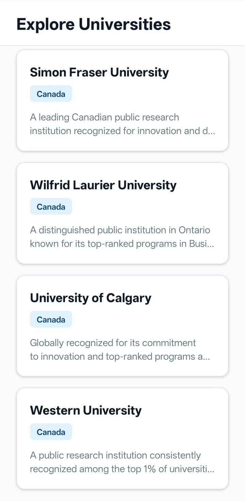
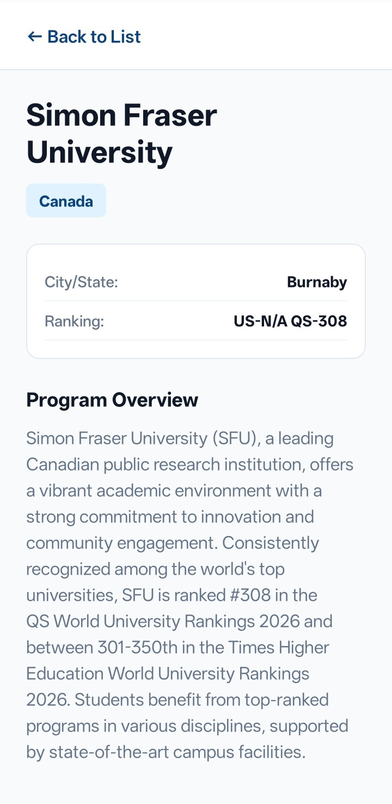

# Waygood-Task
# 🎓 Study Abroad Universities App

A responsive, cleanly architected React Native mobile application built for browsing international university programs. This project demonstrates modern UI/UX principles, component reusability, efficient list rendering, and robust cross-screen navigation.

## ✨ Key Features

* **Custom Responsive Landing Page:** Features a scrollable, stylized hero section with dynamic layout handling to fit any screen size.
* **Optimized List Rendering:** Utilizes React Native's `FlatList` for performant mapping of JSON university data.
* **Clean Navigation Stack:** Uses `@react-navigation/native-stack` for smooth screen transitions and seamless parameter passing.
* **Modular Components:** UI elements like `ProgramCard` and `InfoRow` are extracted into reusable components to keep screens clean and maintainable.
* **Centralized Theming:** Design system built into a constants file, ensuring consistent branding and easy updates.
* **SafeArea Handling:** Fully compatible with modern iOS and Android notches using `react-native-safe-area-context`.

## 📸 Screenshots

| Welcome Screen | Explore Universities | Program Details |
| :---: | :---: | :---: |
|  |  |   |

## 🚀 Setup & Installation Instructions

### Prerequisites

Before you begin, ensure you have the following installed on your machine:
* [Node.js](https://nodejs.org/) (v16 or newer recommended)
* Git

### 1. Clone the repository

Open your terminal and run:

```bash
git clone https://github.com/TanmaySalavkar/Waygood-Task.git
cd study-abroad-app
```

### 2. Install Dependencies

This project uses npm (Node Package Manager). Run the following command to install all required packages:

```bash
npm install
```

### 3. Start the Development Server

Run the Expo CLI to start the local development server:

```bash
npx expo start
```

### 4. Run the Application

Once the server starts, a QR code will appear in your terminal. You can run the app in a few different ways:

* **On a Physical Device:** Download the **Expo Go** app from the Apple App Store or Google Play Store. Open the app and scan the QR code generated in your terminal.
* **On an iOS Simulator:** Press `i` in the terminal (Requires Xcode installed on a Mac).
* **On an Android Emulator:** Press `a` in the terminal (Requires Android Studio installed).
